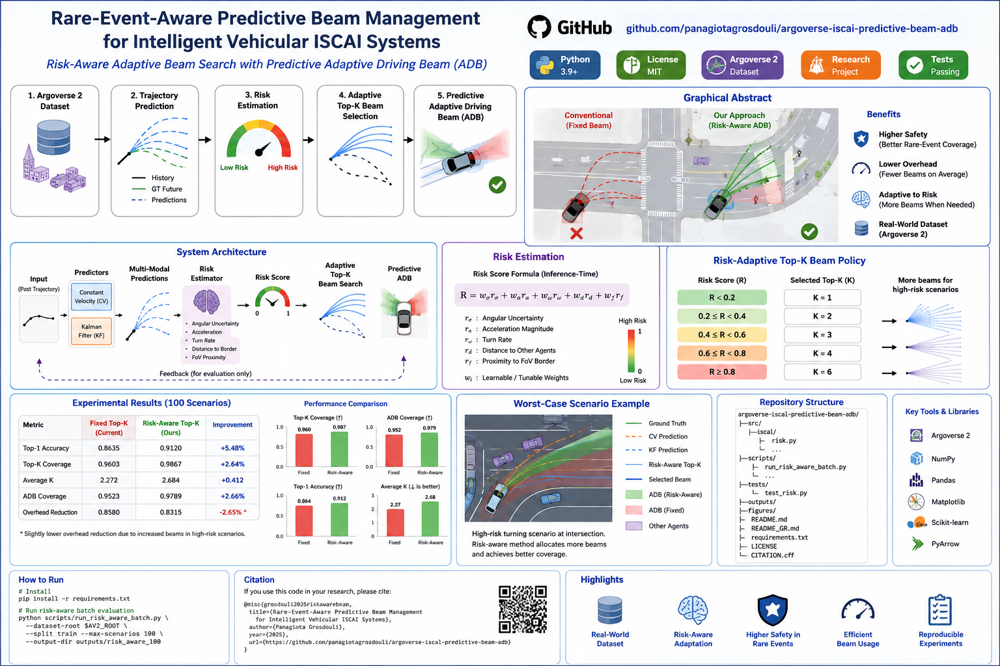

<p align="center">
  
</p>

<h1 align="center">🚗 Argoverse ISCAI</h1>
<h3 align="center">Uncertainty-Aware Predictive Beam and Illumination Control</h3>

<p align="center">
  <strong>Trajectory Prediction • Risk Estimation • Adaptive Top-K Beam Selection • Predictive ADB</strong>
</p>

<p align="center">
  <a href="https://www.python.org/"></a>
  <a href="https://www.argoverse.org/av2.html"></a>
  
  <a href="LICENSE"></a>
</p>

<p align="center">
  <a href="README_GR.md">🇬🇷 Ελληνική τεκμηρίωση</a>
</p>

> **From synthetic tracks to real traffic scenes:** short-horizon trajectory prediction, uncertainty propagation, adaptive beam probing, and predictive adaptive driving beam control for vehicular integrated sensing, communication, and illumination (ISCAI).

---

## Overview

This repository implements **Part B** of a vehicular PC-FMCW laser-headlamp research project. The original signal-processing chain—PC-FMCW/DPSK transmission, range-Doppler processing, CA-CFAR detection, and illumination control—is treated as Part A. This repository focuses on the research extension:

```text
Argoverse 2 real-world trajectories
                ↓
Short-horizon motion prediction
                ↓
Cartesian-to-angular uncertainty propagation
                ↓
Adaptive Top-K directional beam probing
                ↓
Predictive uncertainty-aware ADB shadow zones
```

The central research question is:

> Can future actor motion and its uncertainty reduce directional beam-search overhead while preserving beam coverage and predictive illumination safety?

---

## Main contributions

- Real-world evaluation on **Argoverse 2 Motion Forecasting** scenarios.
- Ego-centric trajectory preprocessing at 10 Hz.
- Constant-velocity and Kalman motion baselines.
- ADE, FDE, and angular-error evaluation.
- Geometry-derived directional beam codebook.
- Probabilistic adaptive Top-K beam selection.
- Uncertainty-aware predictive ADB angular shadow intervals.
- Batch evaluation, bootstrap confidence intervals, and worst-case analysis.
- Inference-time **risk estimator** using angular uncertainty, motion non-linearity, range, and field-of-view proximity.
- Risk-adaptive beam coverage and ADB confidence policies.

---

## Current experimental results

The following results were obtained on the first 100 Argoverse 2 training scenarios processed by the batch pipeline.

### Trajectory prediction

| Predictor | ADE ↓ | FDE ↓ | Mean angular error ↓ |
|---|---:|---:|---:|
| Constant velocity | **1.910 m** | **5.005 m** | **3.931°** |
| Kalman constant velocity | 2.337 m | 5.602 m | 5.080° |

Constant velocity produced lower ADE in **73%** of scenarios and lower FDE in **69%**. The paired mean ADE difference, `Kalman − CV`, was **0.427 m**, with a 95% bootstrap confidence interval of **[0.112, 0.744] m**.

### Beam and predictive ADB control

| Metric | Result |
|---|---:|
| Top-1 beam accuracy | 86.35% |
| Adaptive Top-K coverage | 96.03% |
| Average selected beams | 2.27 / 16 |
| Beam-search overhead reduction | 85.80% |
| Predictive ADB angular coverage | 95.23% |

These numbers are **geometry-derived control metrics**, not measured optical-channel beam-power results. External validation with measured or ray-traced channel labels remains future work.

---

## Why risk-aware control?

Average metrics hide rare but safety-critical failures. In the 100-scenario experiment:

- 35 scenarios contained at least one Top-1 beam failure,
- 11 scenarios had adaptive Top-K coverage below 100%,
- 12 scenarios had predictive ADB coverage below 100%,
- several worst cases exhibited very large angular errors despite strong median performance.

The risk-aware extension uses only information available at inference time:

\[
R = w_\sigma r_\sigma + w_a r_a + w_\omega r_\omega + w_d r_d + w_f r_f,
\]

where the normalized terms represent:

- predicted angular uncertainty,
- recent acceleration,
- recent turn rate,
- close-range sensitivity,
- proximity to the beam-codebook field-of-view boundary.

The risk score changes the requested probability coverage and ADB confidence multiplier:

| Risk score | Beam probability target | ADB confidence scale |
|---:|---:|---:|
| `< 0.25` | 90.0% | 1.64σ |
| `0.25–0.50` | 95.0% | 1.96σ |
| `0.50–0.75` | 98.0% | 2.33σ |
| `≥ 0.75` | 99.5% | 2.58σ |

This policy spends additional beam probes only when the estimated motion/control risk is high.

---

## Repository structure

```text
.
├── configs/                       Experiment configuration
├── data/                          Dataset instructions; raw AV2 data are ignored
├── docs/
│   ├── image2.png                 Generated research infographic
│   └── graphical_abstract.svg     Vector graphical abstract
├── scripts/
│   ├── inspect_scenario.py        Visualize one AV2 scenario
│   ├── run_baseline_demo.py       End-to-end single-scenario demo
│   ├── run_batch_baselines.py     Batch baseline evaluation
│   ├── analyze_batch_results.py   Bootstrap statistics and worst cases
│   └── run_risk_aware_batch.py    Fixed vs risk-aware control comparison
├── src/iscai/
│   ├── adb.py                     Predictive angular shadow zones
│   ├── beam.py                    Beam codebook and adaptive Top-K
│   ├── data.py                    AV2 loading and actor-track extraction
│   ├── evaluation.py              Trajectory and angular metrics
│   ├── geometry.py                Ego-centric coordinate transformations
│   ├── prediction.py              CV and Kalman predictors
│   └── risk.py                    Inference-time risk estimator
├── tests/                         Unit tests
└── outputs/                       Generated figures, CSVs, and JSON metrics
```

---

## Installation

Python 3.10 or 3.11 is recommended.

```bash
git clone https://github.com/panagiotagrosdouli/argoverse-iscaI-predictive-beam-adb.git
cd argoverse-iscaI-predictive-beam-adb

python3 -m venv .venv
source .venv/bin/activate
python -m pip install --upgrade pip
pip install -r requirements.txt
pip install -e .
```

For WSL/Linux, point the project to an existing Argoverse 2 installation:

```bash
export AV2_ROOT=/home/<user>/Datasets/Argoverse2
```

Expected dataset layout:

```text
$AV2_ROOT/
├── train/<scenario_id>/scenario_<scenario_id>.parquet
├── val/<scenario_id>/scenario_<scenario_id>.parquet
└── test/<scenario_id>/scenario_<scenario_id>.parquet
```

Do not commit Argoverse data to this repository.

---

## Quick start

### Inspect one scenario

```bash
SCENARIO=$(find "$AV2_ROOT/train" -name "scenario_*.parquet" | head -n 1)

python scripts/inspect_scenario.py \
  --scenario "$SCENARIO" \
  --output outputs/figures/scenario.png
```

### Run one end-to-end demonstration

```bash
python scripts/run_baseline_demo.py \
  --scenario "$SCENARIO" \
  --output-dir outputs/demo
```

Generated files:

```text
outputs/demo/trajectory_prediction.png
outputs/demo/metrics.json
```

### Run the 100-scenario baseline experiment

```bash
python scripts/run_batch_baselines.py \
  --dataset-root "$AV2_ROOT" \
  --split train \
  --max-scenarios 100 \
  --output-dir outputs/batch_100
```

### Analyze confidence intervals and worst cases

```bash
python scripts/analyze_batch_results.py \
  --csv outputs/batch_100/per_scenario_metrics.csv \
  --output-dir outputs/batch_100/analysis
```

### Compare fixed and risk-aware control

```bash
python scripts/run_risk_aware_batch.py \
  --dataset-root "$AV2_ROOT" \
  --split train \
  --max-scenarios 100 \
  --output-dir outputs/risk_aware_100
```

The comparison reports coverage gains, added beam probes, and the change in beam-search overhead.

---

## Scientific metrics

### Trajectory prediction

- Average Displacement Error (ADE)
- Final Displacement Error (FDE)
- Mean angular error

### Beam management

- Top-1 beam accuracy
- Adaptive Top-K coverage
- Average number of selected beams
- Overhead reduction relative to exhaustive search
- Coverage-overhead trade-off

### Predictive ADB

- Angular shadow coverage
- Shadow-zone violation rate
- Angular interval width and over-masking

### Statistical analysis

- Paired predictor comparisons
- Bootstrap 95% confidence intervals
- Worst-case scenario ranking
- Failure counts and tail analysis

---

## Methodological limitations

1. Beam labels are derived from relative actor azimuth and a geometric codebook.
2. The current experiments do not use measured optical beam-power vectors.
3. Actor trajectories are based on dataset annotations rather than detections from the PC-FMCW sensing front end.
4. The ADB evaluation is angular and does not yet include a full photometric SAE J3069 simulation.
5. The risk policy is interpretable and hand-calibrated; learned or conformal risk calibration is future work.

These limitations are stated explicitly to separate demonstrated results from planned extensions.

---

## Research roadmap

- [x] Real-world AV2 trajectory pipeline
- [x] Constant-velocity and Kalman baselines
- [x] Uncertainty propagation to beam probabilities
- [x] Predictive ADB angular control
- [x] Batch evaluation and bootstrap analysis
- [x] Worst-case scenario analysis
- [x] Inference-time risk estimator
- [x] Risk-adaptive Top-K and ADB confidence
- [ ] Risk-policy calibration on validation data
- [ ] GRU or Transformer trajectory predictor
- [ ] Pedestrian/cyclist class-aware safety margins
- [ ] DeepSense or ray-traced beam-label validation
- [ ] Full optical/photometric ADB evaluation

---

## Research status

This is an active academic research prototype. Results should be interpreted within the assumptions and limitations above. Reproducibility, transparent evaluation, and explicit separation between measured and geometry-derived quantities are design priorities.

---

## Citation

A `CITATION.cff` file is included for software citation. A paper-style BibTeX entry will be added when the accompanying manuscript is finalized.

---

## License and data terms

The source code is released under the MIT License. Argoverse 2 data are not redistributed and remain governed by the original dataset license and terms.
